```
Запустить программу в фоновом режиме (myprogram &). Узнать
идентификатор процесса и протестировать команды управления (SIGINT,
SIGQUIT, SIGABRT, SIGKILL, SIGTERM, SIGTSTP, SIGSTOP, SIGCONT).
Для сдачи задания нужно прислать исходный код программы и скриншоты с
комментариями (что тестируется, какое результат вы ожидаете и что
фактически получилось).
```

## запуск программы в фоновом режиме

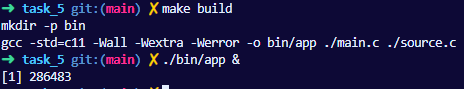

*просто компилируем и запускаем в фоне программу*

## идентификатор процесса

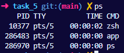

*смотрим через ps номер процесса в нашей оболочке*

## SIGINT

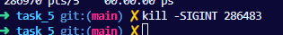

*отправляем SIGINT, ожидаемое поведение - увидеть в файле сообщение об сигнале и увеличить счетчик сигналов. Если отправить три SIGINT - то завершение программы*

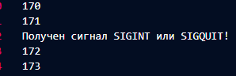

*вот и сообщение*

## SIGQUIT


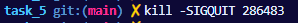

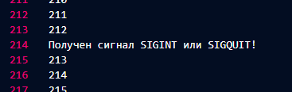

*отправляем SIGQUIT ожидаемое поведение - получить только сообщение в программе, не увеличивая счетчика*

## SIGABRT

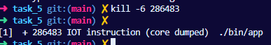

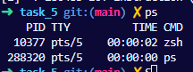

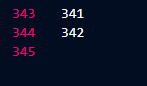

*отправляем SIGABRT(или в WSL IOT) ожидаемое поведение - завершение программы с созданием дампа памяти, не увеличивая счетчика*

## SIGKILL

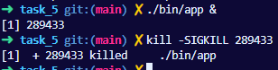

*отправляем SIGKILL - момементальное завершение процесса, возможно искажение данных в файле*

## SIGTERM

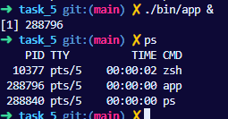

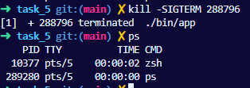

*отправляем SIGTERM - стандартное завершение процесса*

## SIGTSTP

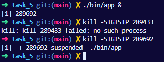

*отправляем SIGTERM, остановка процесса (перевод в фоновый остановленный режим)*

## SIGSTOP

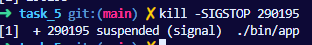

*отправляем SIGSTOP, остановка процесса, но эту версию сигнала нельзя перехватить* 

## SIGCONT

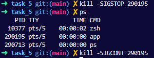

*отправляем SIGCONT, вознобновленние процесса из спячки*
