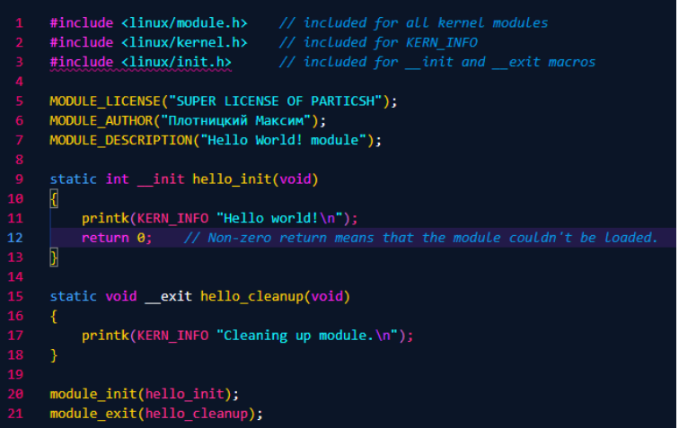
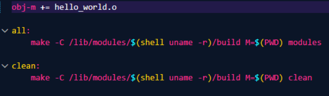
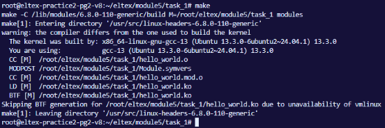
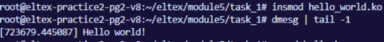
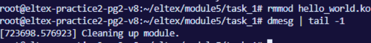

# task
```
Задание 1 по модулю 5: Написать модуль ядра Hello World для своей версии ядра. 
Поменять описание модуля, добавить себя как автора и придумать свою лицензию. 
Результаты выложить на github или др. общедоступный git. Cсылку на git выслать в ЛС 
для проверки. 
Скрины запуска модуля не забываем. 
Пример модуля ядра https://www.thegeekstuff.com/2013/07/write-linux-kernel-module/ 
```
 
## 1. Взяли пример ядра из ссылки и изменили под себя 


 
## 2. Взяли make из ссылки 


 
## 3. Скомпилировали программу 



## 4. Заинзертили модуль ядра, посмотрели логи 


 
## 5. Вытащили модуль ядра и снова посмотрели логи 


 

 
