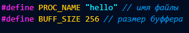
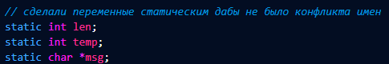
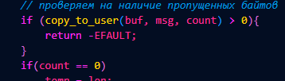
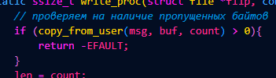
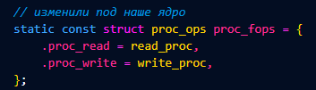
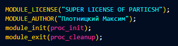
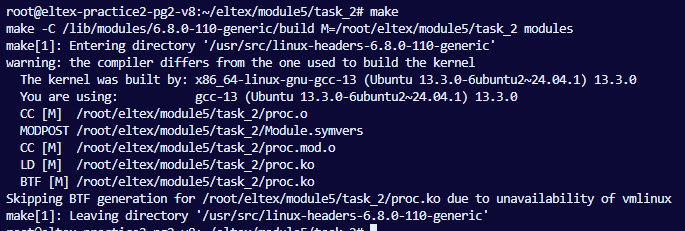
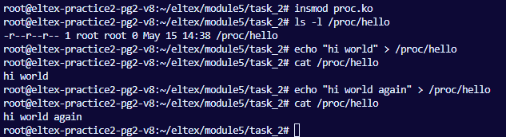

# task
```
Задание 2 по модулю 5: Написать модуль ядра для своей версии ядра, который будет 
обмениваться  
информацией с userspace через proc. Адаптировать для своей версии ядра (Структура 
обработчиков). Избавиться от харкода (маг чисел) и изолировать переменные модуля 
(static). Результаты выложить на github или др. общедоступный git.  
Cсылку на git выслать в ЛС для проверки. Скрины запуска, работы и тестирования 
работы модуля прилагаем. 
```

## 1. Исправляем ошибки 

### Убераем магические числа



### сделали переменные статиком



### Проверяем вывод функций





### Имя структуры поменялось



### Наше лицензия и имя



### Также все методы под статиком 
 
## 2. Скомпилировали модуль ядра 
 


## 3. Протестировали работу модуля ядра(как и должен создает  файл в /proc, работает ввод и вывод из файла) 




